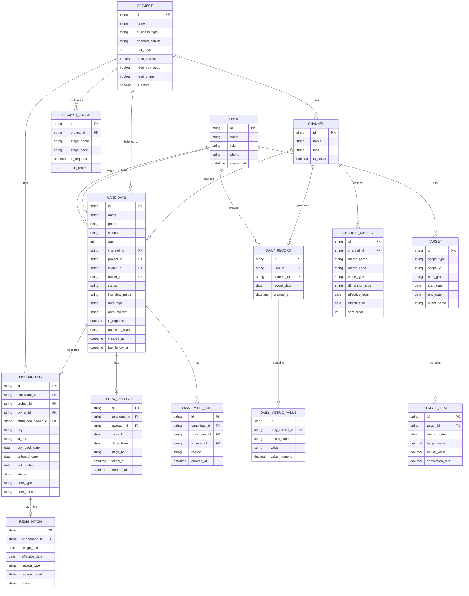

# 招聘/外包业务管理系统 PRD v0.2

> 版本：v0.2.1 | 日期：2026-03-04 | 状态：已确认

---

## 目录

1. [业务背景](#一业务背景)
2. [统一口径字典](#二统一口径字典)
3. [实体关系设计](#三实体关系设计)
4. [**S1 指标配置与维度设计**](#四s1-指标配置与维度设计)
5. [**目标模型（S4）分型**](#五目标模型s4分型)
6. [**数据结构对照 Excel 的差异清单**](#六数据结构对照-excel-的差异清单)
7. [权限矩阵](#七权限矩阵)
8. [MVP功能范围](#八mvp功能范围)
9. [关键页面清单](#九关键页面清单)
10. [风险清单](#十风险清单)
11. [数据初始化说明](#十一数据初始化说明)

---

## 一、业务背景

### 1.1 业务模式

| 模式 | 劳动关系 | 工资发放 | 收费方式 | 关键节点 |
|:---|:---|:---|:---|:---|
| **招聘服务** | 客户 | 客户 | 服务费 | 入职 |
| **外包/派遣** | 我司 | 我司 | 工资+服务费 | 入职+上线 |

### 1.2 现状问题

- Excel 4个Sheet各自独立，数据不联动
- 备注/说明字段非结构化，无法统计分析
- 渠道/指标/项目流程变化时，扩展困难
- 无权限控制，数据安全风险

### 1.3 系统目标

- 业务员：维护日常进度、候选人跟进
- 运营：维护入职登记、目标管理；查看统计分析
- 管理员：系统配置、用户管理

---

## 二、统一口径字典

### 2.1 状态/事件定义

| 序号 | 状态/事件 | 定义 | 类型 | 同义词/备注 |
|:---:|:---|:---|:---:|:---|
| 1 | **线索** | 从渠道获取的候选人原始信息（电话/简历/报名） | 通用 | 已报名、已查看简历、收获简历 |
| 2 | **意向** | 明确表达求职意愿，愿意进一步沟通 | 通用 | 意向线索、有效线索 |
| 3 | **加微信** | 成功添加候选人微信，建立私域连接 | 通用 | 交换微信、交换电话微信 |
| 4 | **约面** | 与候选人约定面试时间/地点 | 通用 | 约面试 |
| 5 | **到面** | 候选人实际参加面试 | 通用 | 面试到场 |
| 6 | **面试通过** | 面试评估合格，可进入下一环节 | 通用 | 面试反馈-通过 |
| 7 | **到培/到训** | 候选人参加培训（项目特定） | 可配置 | 培训到场 |
| 8 | **购包** | 候选人购买工装包/入职材料包 | 可配置 | 京东项目作为入职标志 |
| 9 | **入职** | 候选人完成入职手续，正式成为员工 | 通用 | 入职成功 |
| 10 | **上线** | 入职后实际开始工作/出勤 | 通用 | 实际到岗 |
| 11 | **试单** | 入职初期的试用/考核阶段 | 可配置 | 试工期、试用期 |
| 12 | **离职** | 员工离开岗位（含主动/被动） | 通用 | 流失 |
| 13 | **未入职** | 已有入职意向但最终未入职 | 通用 | 放弃入职 |
| 14 | **未到训** | 约定培训但未到场 | 可配置 | 培训缺席 |
| 15 | **线索失效** | 线索超过跟进周期无响应或明确拒绝 | 通用 | 无效线索、沉睡线索 |
| 16 | **复聊** | 与候选人再次发起沟通 | 通用 | 再次沟通、跟进 |
| 17 | **打招呼** | 在招聘平台首次发起联系 | 通用 | 我打招呼、发起沟通 |

### 2.2 入职口径配置

| 项目 | 入职口径 | 说明 |
|:---|:---|:---|
| 京东家政 | 购包 | 购买工装包视为入职 |
| 轻喜 | 入职 | 完成入职手续视为入职 |
| 洲际 | 入职 | 无购包环节 |
| 其他项目 | 可配置 | 新增项目时选择口径 |

### 2.3 试单期配置

- 项目维度可选配置
- 勾选"有试单期"后填写天数
- 到期前系统提醒（可选）
- 不填则不提醒

---

## 三、实体关系设计

### 3.1 实体关系图



### 3.2 核心实体说明

| 实体 | 说明 | 关键字段 |
|:---|:---|:---|
| USER | 用户（业务员/运营/管理员） | id, name, role, phone |
| PROJECT | 招聘项目（配置化，不写死） | name, onboard_criteria, need_training, need_buy_pack |
| CHANNEL | 招聘渠道（BOSS/快手/58/线下） | name, type |
| CHANNEL_METRIC | 渠道指标配置 | metric_code, value_type, dimension_type, effective_from/to |
| DAILY_RECORD | 日常进度（主表） | user_id, channel_id, record_date |
| DAILY_METRIC_VALUE | 日常指标值（明细） | metric_code, value（原始）, value_numeric（数值） |
| CANDIDATE | 候选人/线索 | inviter_id, owner_id, status, note_type |
| FOLLOW_RECORD | 跟进记录 | stage_from, stage_to, follow_at, created_at |
| OWNERSHIP_LOG | 归属变更日志 | from_user_id, to_user_id, reason |
| TARGET | 目标（支持多维度） | scope_type, time_grain, event_name |
| TARGET_ITEM | 目标明细 | metric_code, target_value（decimal）, actual_value（decimal）, conversion_rate |
| ONBOARDING | 入职登记 | attribution_owner_id, status（枚举） |
| RESIGNATION | 离职记录 | effective_date, stage, reason_type |

### 3.3 三种"人"的角色

| 角色 | 字段 | 说明 |
|:---|:---|:---|
| **邀约人** | inviter_id | 线索最初是谁拉来的（可空） |
| **跟进人** | owner_id | 当前谁在跟进/维护 |
| **归属人** | attribution_owner_id | 入职最终归属/结算归属（入职表） |

### 3.4 入职状态枚举

| 状态值 | 说明 | 触发条件 |
|:---|:---|:---|
| pending | 待上线 | 已入职但未上线 |
| online | 在职 | 已上线 |
| offline | 已下线 | 主动/被动下线 |
| trial_resign | 试单离职 | 试单期内离职 |
| refunded | 已退费 | 购包后退费 |
| not_online | 未上线 | 入职后未实际上线 |

### 3.5 候选人说明字段设计

| 字段 | 类型 | 必填 | 说明 |
|:---|:---:|:---:|:---|
| note_type | 下拉 | 否 | 说明类型：离职原因/未入职原因/重复线索/其他 |
| note_content | 文本 | 否 | 补充说明（自定义填写） |
| is_duplicate | 布尔 | 是 | 是否重复线索 |
| duplicate_reason | 文本 | 否 | 重复原因/来源说明（重复时必填） |

---

## 四、S1 指标配置与维度设计

### 4.1 问题背景

Excel S1 中存在两类指标：

| 类型 | 示例 | 特征 |
|:---|:---|:---|
| **漏斗数** | 线索量、打招呼、复聊、约面、到培、入职 | 单一数值 |
| **维度统计** | 入职项目（京东/轻喜）、入职项目（上海/苏州） | 带维度拆分 |

若只用 `metrics(json)` 存储，后续统计、目标关联、历史迁移都会困难。

### 4.2 解决方案：指标拆分两层

```
daily_record（人/渠道/日期）
    └── daily_metric_value（一条指标一行）
            ├── metric_code: "onboard"
            ├── value: "5"（原始填写）
            ├── value_numeric: 5.00（数值，用于统计）
```

### 4.3 DAILY_METRIC_VALUE 字段设计

| 字段 | 类型 | 说明 |
|:---|:---|:---|
| value | string | 原始填写值（保留用户输入） |
| value_numeric | decimal(10,2) | 数值化值（用于统计计算，可空） |

**设计理由：** 既保留原始填写信息，又支持数值统计。

### 4.4 CHANNEL_METRIC 增强字段

| 字段 | 类型 | 说明 |
|:---|:---|:---|
| value_type | enum | number（数字）/ enum（枚举）/ text（文本） |
| effective_from | date | 指标生效日期 |
| effective_to | date | 指标失效日期（NULL表示持续有效） |

### 4.5 示例数据

**渠道指标配置：**

| channel_id | metric_name | metric_code | value_type | dimension_type |
|:---|:---|:---|:---|:---|
| boss_1 | 线索量 | lead_count | number | none |
| boss_1 | 打招呼 | greet | number | none |
| boss_1 | 入职 | onboard | number | project |
| kuaishou | 入职项目 | onboard_project | number | project |

**日常指标值：**

| daily_record_id | metric_code | value | value_numeric |
|:---|:---|:---:|:---:|
| dr_001 | lead_count | 100 | 100.00 |
| dr_001 | greet | 50 | 50.00 |
| dr_001 | onboard | 3 | 3.00 |
| dr_001 | onboard | 2 | 2.00 |

### 4.5 统计查询示例

```sql
-- 查询某月入职总数
SELECT SUM(value_numeric) as onboard_count
FROM daily_metric_value
WHERE metric_code = 'onboard'
  AND daily_record_id IN (
    SELECT id FROM daily_record 
    WHERE record_date BETWEEN '2025-12-01' AND '2025-12-31'
  );
```

---

## 五、目标模型（S4）分型

### 5.1 问题背景

Excel S4 中存在三类目标形态：

| 类型 | 示例 | 特征 |
|:---|:---|:---|
| **业务员每日转化目标** | 意向7.4个/到培2.2个/购包2个 | 按人+天，有转化率假设 |
| **平台月度漏斗目标** | 线索13889/交换微信417/入职20 | 按渠道+月 |
| **单场培训目标** | 某场培训的目标 | 按事件 |

原 TARGET 模型只支持"用户+period"，无法覆盖。

### 5.2 解决方案：TARGET 增加 scope 与 time_grain

**TARGET 表增强字段：**

| 字段 | 类型 | 说明 |
|:---|:---|:---|
| scope_type | enum | user（个人）/ channel（渠道）/ project（项目）/ event（事件） |
| scope_id | string | 关联的用户ID/渠道ID/项目ID/事件ID |
| time_grain | enum | day（日）/ month（月）/ event（事件） |
| event_name | string | 事件名称（如"12月第一场培训"） |

**TARGET_ITEM 表增强字段：**

| 字段 | 类型 | 说明 |
|:---|:---|:---|
| conversion_rate | decimal | 转化率假设（用于计算衍生目标，如7.4=2/0.27） |

### 5.3 示例数据

**类型1：业务员每日转化目标**

| id | scope_type | scope_id | time_grain | start_date | end_date |
|:---|:---|:---|:---|:---|:---|
| t_001 | user | liqiang | day | 2025-12-01 | 2025-12-31 |

| target_id | metric_code | target_value | conversion_rate |
|:---|:---|:---:|:---:|
| t_001 | intention | 8 | 0.27 |
| t_001 | to_train | 3 | 0.67 |
| t_001 | buy_pack | 2 | NULL |

**类型2：平台月度漏斗目标**

| id | scope_type | scope_id | time_grain | start_date | end_date |
|:---|:---|:---|:---|:---|:---|
| t_002 | channel | boss_all | month | 2025-03-01 | 2025-03-31 |

| target_id | metric_code | target_value | conversion_rate |
|:---|:---|:---:|:---:|
| t_002 | lead_count | 13889 | NULL |
| t_002 | exchange_wechat | 417 | 0.03 |
| t_002 | onboard | 20 | NULL |

**类型3：单场培训目标**

| id | scope_type | scope_id | time_grain | event_name | start_date |
|:---|:---|:---|:---|:---|:---|
| t_003 | event | evt_001 | event | 12月第一场培训 | 2025-12-05 |

| target_id | metric_code | target_value |
|:---|:---|:---:|
| t_003 | to_train | 50 |
| t_003 | buy_pack | 20 |

### 5.4 达成率计算

```
达成率 = actual_value / target_value

actual_value 来源：
- scope_type=user + time_grain=day → 从 DAILY_METRIC_VALUE 汇总
- scope_type=channel + time_grain=month → 从 DAILY_METRIC_VALUE 按渠道汇总
- scope_type=event → 手动录入或关联培训场次
```

---

## 六、数据结构对照 Excel 的差异清单

### 6.1 差异对照表

| # | 差异点 | Excel现状 | PRD v0.1问题 | PRD v0.2解决方案 |
|:---:|:---|:---|:---|:---|
| A | S1指标带维度 | "入职项目（京东/轻喜）"按项目拆分 | 用json存储，统计困难 | 拆分 daily_record + daily_metric_value，value保留原始，value_numeric用于统计 |
| B | 三种"人"的角色 | 邀约人/跟进招聘人员/线索归属人混用 | 只有owner_id | 增加inviter_id, attribution_owner_id，增加OWNERSHIP_LOG |
| C | 项目配置 | 已有京东/轻喜/洲际 | 正文写死"京东/轻喜" | PROJECT增加need_training/need_buy_pack/need_online开关 |
| D | S3备注非结构化 | "试单期间走了/已退费/未上线" | 只有note_type | ONBOARDING增加status枚举，RESIGNATION增加effective_date |
| E | S4目标三类混在一起 | 业务员每日/平台月度/单场培训 | 只支持"用户+period" | TARGET增加scope_type/time_grain/event_name |
| F | 指标生效日期 | 渠道指标可能变化 | 提到但无字段 | CHANNEL_METRIC增加effective_from/effective_to |
| G | 跟进记录状态变更 | 手写"跟进时间和进度" | stage_change是文本 | 拆为stage_from + stage_to结构化，增加follow_at区分业务时间与系统时间 |
| H | 日期校验 | Excel有日期倒挂/填错年 | 无校验规则 | 增加校验：online_date ≥ onboard_date ≥ buy_pack_date |

### 6.2 数据校验规则

| 规则 | 校验逻辑 | 触发时机 |
|:---|:---|:---|
| 日期顺序 | online_date ≥ onboard_date ≥ buy_pack_date | 入职登记保存时 |
| 手机号格式 | 11位数字，1开头 | 线索录入/导入时 |
| 必填检查 | 候选人姓名、电话必填 | 线索录入时 |
| 重复提示 | 手机号已存在时提示，允许继续录入 | 线索录入时 |
| 试单天数 | trial_days > 0 时才能开启到期提醒 | 项目配置时 |

### 6.3 数据安全要求

| 安全项 | 要求 | 说明 |
|:---|:---|:---|
| **手机号脱敏** | 列表页默认显示 `189****9745` | 点"查看完整"需二次确认/权限 |
| **敏感字段审计** | phone / id_card / status / owner_id 修改留日志 | 记录：谁、何时、改了什么、原值→新值 |
| **导出权限** | 仅运营/管理员可导出 | 业务员不可导出数据 |
| **登录安全** | 手机验证码登录，验证码5分钟有效 | 防止暴力破解 |

---

## 七、权限矩阵

| 功能模块 | 操作 | 业务员 | 运营 | 管理员 |
|:---|:---:|:---:|:---:|:---:|
| **日常进度** | 录入/修改自己的数据 | ✅ | ✅ | ✅ |
| | 查看他人数据 | ❌ | ✅ | ✅ |
| | 删除 | ❌ | ✅ | ✅ |
| **候选人跟进** | 新增线索 | ✅ | ✅ | ✅ |
| | 跟进自己的线索 | ✅ | ✅ | ✅ |
| | 查看/编辑他人线索 | ❌ | ✅ | ✅ |
| | 导出 | ❌ | ✅ | ✅ |
| **入职登记** | 查看 | ❌ | ✅ | ✅ |
| | 新增/编辑 | ❌ | ✅ | ✅ |
| **目标管理** | 查看自己的目标 | ✅ | ✅ | ✅ |
| | 设置目标 | ❌ | ✅ | ✅ |
| **统计分析** | 查看个人数据 | ✅ | ✅ | ✅ |
| | 查看全员汇总 | ❌ | ✅ | ✅ |
| | 按项目/渠道分析 | ❌ | ✅ | ✅ |
| **系统配置** | 管理用户/角色 | ❌ | ❌ | ✅ |
| | 管理渠道/项目 | ❌ | ❌ | ✅ |
| | 配置流程阶段 | ❌ | ❌ | ✅ |

---

## 八、MVP功能范围

### 8.1 Must（必须有）

| 编号 | 功能模块 | 功能点 | 说明 |
|:---:|:---|:---|:---|
| M1 | 用户登录 | 手机验证码登录 | 区分角色权限 |
| M2 | 候选人管理 | 线索录入 | 姓名、电话、渠道、项目、说明字段 |
| | | 状态跟进 | 状态流转（结构化stage_from→stage_to） |
| | | 列表查询 | 筛选、搜索、状态筛选 |
| | | 入职锁定 | 入职后仅运营可编辑 |
| | | 归属变更 | 记录变更日志 |
| M3 | 日常进度 | 按渠道录入 | 选择渠道→填写各指标（含维度）→提交 |
| | | 历史查看 | 查看自己的历史记录 |
| M4 | 入职登记 | 信息维护 | 入职人员增删改查，状态枚举 |
| | | 离职登记 | 离职原因类型化，effective_date |
| M5 | 基础配置 | 项目管理 | 名称、入职口径、试单周期、流程开关 |
| | | 渠道管理 | 名称、指标配置（含维度类型、生效日期） |
| | | 用户管理 | 用户增删改、角色分配 |
| M6 | 数据导入 | Excel导入 | 导入现有Excel数据，含校验 |

### 8.2 Should（应该有）

| 编号 | 功能模块 | 功能点 | 说明 |
|:---:|:---|:---|:---|
| S1 | 目标管理 | 设置目标 | 支持三类目标（用户/渠道/事件） |
| | | 达成统计 | 自动关联日常数据计算达成率 |
| S2 | 统计看板 | 个人工作台 | 业务员查看自己的数据汇总 |
| | | 运营看板 | 全员汇总、项目进展、渠道分析 |
| S3 | 线索流转 | 变更历史 | 候选人状态变更时间线（结构化） |
| S4 | 线索转派 | 归属变更 | 支持线索转给其他业务员 |

### 8.3 Could（可以有）

| 编号 | 功能模块 | 功能点 | 说明 |
|:---:|:---|:---|:---|
| C1 | 数据导出 | 导出Excel | 候选人/入职/统计报表导出 |
| C2 | 项目流程配置 | 流程阶段 | 不同项目启用不同流程阶段 |
| C3 | 消息提醒 | 跟进提醒 | 线索超时未跟进提醒 |
| | | 试单到期 | 试单周期到期提醒 |
| C4 | 移动端 | H5适配 | 手机端数据录入 |

### 8.4 不做（本期）

- 自动化招聘平台数据抓取
- 短信/微信自动触达
- 复杂数据权限（按项目/渠道授权）
- 薪资/结算管理
- 多租户/多公司隔离

---

## 九、关键页面清单

| 页面 | 角色 | 核心功能 |
|:---|:---|:---|
| **登录页** | 全部 | 手机验证码登录 |
| **个人工作台** | 业务员 | 今日待办、目标达成、最近线索 |
| **候选人列表** | 业务员/运营 | 筛选（状态/渠道/项目/归属）、搜索、新增 |
| **候选人详情** | 业务员/运营 | 基本信息、跟进时间线、状态流转（结构化）、归属变更日志 |
| **日常进度录入** | 业务员 | 选择渠道→填写指标（含维度拆分）→提交 |
| **日常进度历史** | 业务员/运营 | 按日期查看历史记录 |
| **入职登记列表** | 运营 | 查看/新增/编辑入职人员，状态筛选 |
| **入职详情** | 运营 | 入职信息、离职记录、状态枚举 |
| **目标管理** | 运营 | 设置三类目标（用户/渠道/事件），达成率统计 |
| **统计看板** | 运营 | 项目汇总、渠道分析、人员排名 |
| **项目管理** | 管理员 | 项目CRUD、入职口径、试单周期、流程开关 |
| **渠道管理** | 管理员 | 渠道CRUD、指标配置（含维度类型、生效日期） |
| **用户管理** | 管理员 | 用户CRUD、角色分配 |
| **数据导入** | 管理员 | Excel导入、数据校验 |

---

## 十、风险清单

| 序号 | 风险点 | 影响 | 解决方案 | 状态 |
|:---:|:---|:---|:---|:---:|
| 1 | 购包=入职口径冲突 | 统计口径不一致 | 项目维度配置入职口径 | ✅已确认 |
| 2 | 备注非结构化 | 无法统计原因 | 改为类型下拉+补充说明，入职状态枚举化 | ✅已确认 |
| 3 | 渠道指标可变 | 历史数据对照困难 | 指标配置化+effective_from/effective_to | ✅已确认 |
| 4 | 项目流程差异 | 不同项目流程不同 | 项目流程开关（need_training/need_buy_pack/need_online） | ✅已确认 |
| 5 | 线索归属变更 | 业务员离职/调整 | 支持线索转派+OWNERSHIP_LOG | ✅已确认 |
| 6 | 重复线索 | 数据重复 | 允许重复+必填说明字段 | ✅已确认 |
| 7 | 线下线索 | 非渠道来源 | 渠道增加"线下"+说明字段 | ✅已确认 |
| 8 | 目标与日常挂钩 | 达成率计算 | scope_type匹配，自动关联日常数据 | ✅已确认 |
| 9 | 试单期定义 | 到期提醒 | 项目可选配置+天数填写 | ✅已确认 |
| 10 | 数据权限 | 数据安全 | 按归属人隔离 | ✅已确认 |
| 11 | 历史数据迁移 | 新系统启动 | Excel导入功能 | ✅已确认 |
| 12 | 状态锁定 | 数据一致性 | 入职后锁定，仅运营可编辑 | ✅已确认 |
| 13 | 到培vs到训 | 概念混淆 | 视为同一概念 | ✅已确认 |
| 14 | 影响力指标 | 计算逻辑 | 不参与计算，手动填写 | ✅已确认 |
| 15 | 多人协作 | 线索归属 | MVP单一归属人 | ✅已确认 |
| 16 | 指标带维度 | S1统计困难 | 拆分DAILY_RECORD + DAILY_METRIC_VALUE | ✅新增 |
| 17 | 三种人角色 | 归属混乱 | inviter_id/owner_id/attribution_owner_id | ✅新增 |
| 18 | 目标三类形态 | 无法统一管理 | TARGET增加scope_type/time_grain/event_name | ✅新增 |
| 19 | 日期倒挂 | 数据错误 | 增加校验规则 | ✅新增 |
| 20 | 数值类型精度 | 统计计算 | value_numeric/target_value/actual_value 使用decimal(10,2) | ✅新增 |
| 21 | 原始值丢失 | 数据追溯 | DAILY_METRIC_VALUE保留value原始值+value_numeric数值 | ✅新增 |
| 22 | 跟进时间混淆 | 及时性统计 | FOLLOW_RECORD增加follow_at（业务时间）区分created_at（系统时间） | ✅新增 |
| 23 | 数据安全 | 隐私泄露 | 手机号脱敏、敏感字段审计、导出权限控制 | ✅新增 |

---

## 十一、数据初始化说明

### 11.1 Excel数据映射

| Excel Sheet | 系统表 | 说明 |
|:---|:---|:---|
| S1 日常进度 | DAILY_RECORD + DAILY_METRIC_VALUE | 按业务员+渠道+日期导入，指标拆分明细 |
| S2 候选人跟进 | CANDIDATE + FOLLOW_RECORD | 线索+跟进记录，解析stage_from→stage_to |
| S3 入职登记 | ONBOARDING | 入职人员信息，解析status枚举 |
| S4 目标指标 | TARGET + TARGET_ITEM | 目标数据，区分scope_type |

### 11.2 初始数据准备

- 项目：京东家政、轻喜、洲际
- 渠道：BOSS账号1、BOSS账号2、BOSS账号3、BOSS账号2、快手、58、线下
- 用户：李强（liqiang）、张弛（zhangchi）—业务员；运营（yunying）；管理员（newyetai）
- 指标：按各渠道现有指标配置（含维度类型）

### 11.3 导入校验

- 手机号格式校验
- 日期格式统一
- 日期顺序校验（online_date ≥ onboard_date ≥ buy_pack_date）
- 必填字段检查
- 重复数据提示

---

## 附录：待办事项

- [x] 确认运营人员名单：yunying
- [x] 确认管理员账号：newyetai
- [x] 提供Excel原始数据文件：家政项目日常进度表(1).xlsx
- [x] 确认部署环境：本地

---

> 文档确认人：产品经理
> 版本变更：v0.1 → v0.2（补强S1维度设计、S4目标分型、三种角色、数据校验）
> 版本变更：v0.2 → v0.2.1（字段类型支持小数、原始值保留、follow_at业务时间、数据安全要求）
> 下一步：技术选型与架构设计
